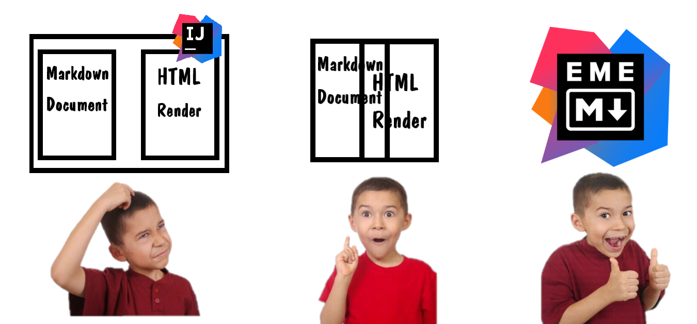
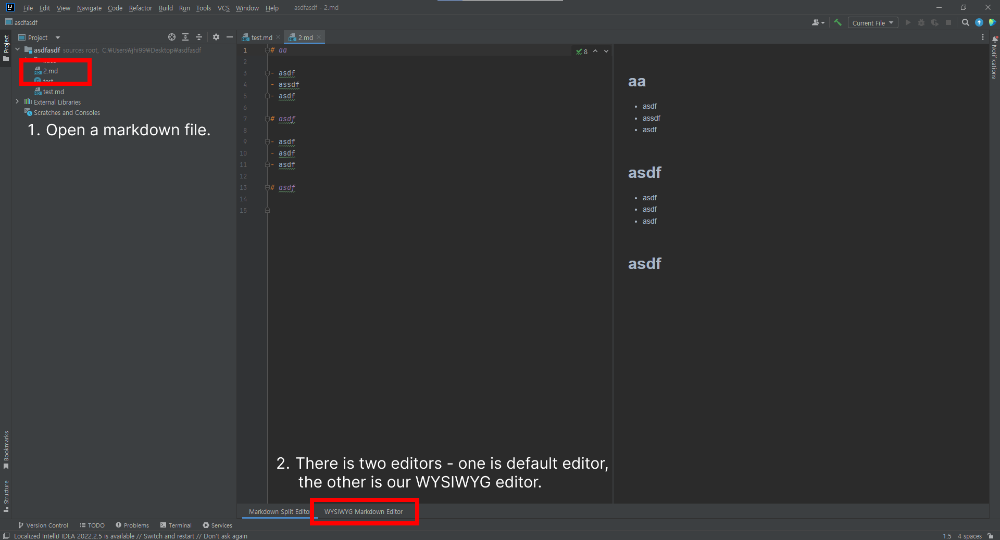
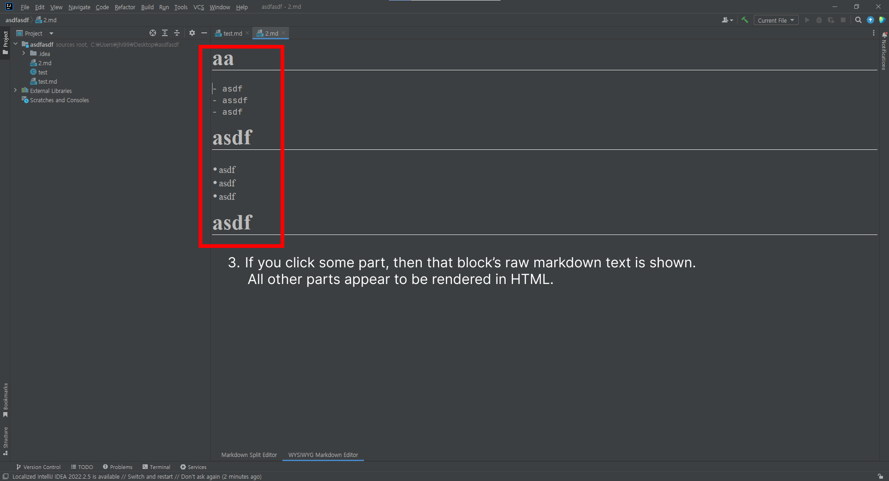
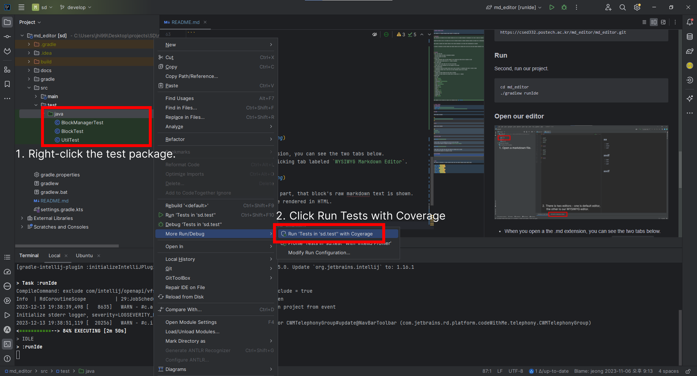
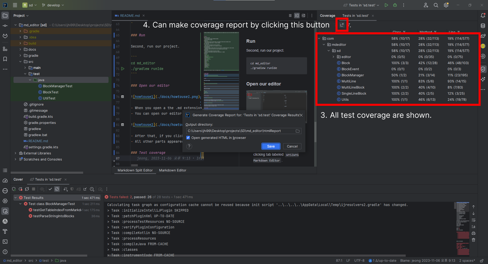

> 


# Intellij Markdown Editor

This project is a **Easy Markdown Editor plugin** in IntelliJ IDEA.

## Motivation
Most developers are familiar with the Markdown language and use it to specify programs. In particular, in the case of GitHub and GitLab, Markdown is an essential language as they also provide a preview of the README.md file.

The Markdown editor provided by default in IntelliJ is divided into two tabs. A Markdown tab is created on the left and a Preview tab is created on the right. Because the Preview tab is not editable, the default Markdown editor has the problem that it takes up too much screen space.

There is an IntelliJ Markdown editor plugin to solve this, but it's actual capablility is far behind their demonstration. This is too heavy and takes a very long time to respond when switching tabs. It crashes and sometimes crashes. [See problems](https://csed332.postech.ac.kr/md_editor/md_editor/-/wikis/Miscellaneous/Problems%20of%20Original%20plugin)

We decided to redevelop and refine markdown editor. With our project, user can **view and edit their Markdown documents simultaneously**.

Because the Markdown is rendered at the same time as user modifies, they can see **immediate changes and improve productivity**. Additionally, this plugin may also be useful for those new to Markdown syntax.


## Features
- Save / load from file
  - Save when closing our editor or terminating IntelliJ.
  - Load when opening our editor.
- Focused block
  - Focused block(block where the cursor located) is not rendered. All others parts are rendered as HTML.
  - Move focused block through click or ↑, ↓ button on keyboard.
- Add / remove block
  - Make new block by type enter key at the end of each block.
  - Remove block by type backspace key at the beginning of each block.
- Block synchronization
  - Automatically divided into several blocks when you edit the middle of a multi-line block such as a table or quote.
  - Automatically combined into one block when you unify consecutive blocks into one format.
- Cursor position
  - Maintains the cursor position when some block is clicked.
  - Maintains the cursor position when focused block is changed with ↑, ↓ buttons.
- Support types
  - Raw text
  - Bold `**bold**`
  - Italic `*italic*`
  - Strikethrough `~~strikethrough~~`
  - Link `[link](link)`
  - Horizontal line `---`
  - Inline code ``
  - Heading `# head`
  - Quote `>`
  - Checkbox `- [ ]`
  - Ordered list `1.`
  - Unordered list `-`
  - Codeblock ```
  - Table `|--|--|`


More details on how it works can be found at the following link: [User Scenario](https://csed332.postech.ac.kr/md_editor/md_editor/-/wikis/User-Scenario)


## Getting started
### Prerequisites
- [IntelliJ IDEA](https://www.jetbrains.com/ko-kr/idea/)
- [Java SE 17](https://www.oracle.com/java/technologies/javase/jdk17-archive-downloads.html)

### Clone

First, clone our project

```
https://csed332.postech.ac.kr/md_editor/md_editor.git
```

### Run

Second, run our project.

```
cd md_editor
./gradlew runIde
```

### Open our editor

> 

- When you open a the .md extension, you can see the two tabs below.
- You can open our editor by clicking tab labeled `WYSIWYG Markdown Editor`.

> 

- After that, if you click some part, that block's raw markdown text is shown.
- All other parts appeared to be rendered in HTML.

### Test coverage

You can run the test by entering the following command.

```
./gradlew test
```

There was a bug where all coverages showed 0%, when create a coverage report using Jacoco test report.

So we used the test coverage supported by IntelliJ.

> 
- Right-click the test package.
- Click `Run with Coverage`

> 
- Then, IntelliJ make test coverage.
- You can even extract coverage report.


## Documentation
- [Wiki](https://csed332.postech.ac.kr/md_editor/md_editor/-/wikis/home)
- [Issue Board](https://csed332.postech.ac.kr/md_editor/md_editor/-/boards)


## Team 
This project is implemented by POSTECH students taking 2023 Fall CSED332 (Software Design Method) class. 

- [Hyeli Jeong](@hyelie)
- [Donghun Shin](@sdh728)
- [Minsu Sun](@poodding397)
- [Hyeonsik Ham](@hhs0515)
- [Hawoo Jung](@howru0321)
- [Yonghwan Kim](@kyh102824)